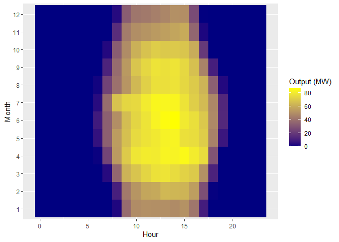
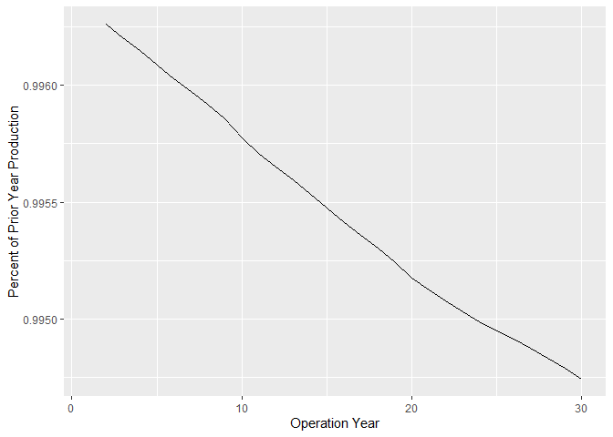
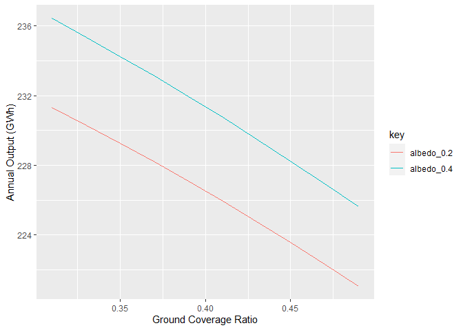

Solar Modeling with R and Python
================
Brock Taute
4/29/2020

# Background

This repo contains a library for modeling the energy output of a
photovoltaic system in R. It leverages several Python modules, most
notably PVLib and PVFactors, using the reticulate package. R was
selected as the main user-interfacing language because it connects these
powerful Python packages with the rapid prototyping capabilities of the
R shiny package, enabling quick development of applications that
incorporate solar energy prediction models.

# Setup

In order to use these libraries, you need Python 3 installed. The
solar\_models.R script will then install the necessary Python modules in
a virtual environment when you source it. If your default Python
interpreter is version 2, you may need to explicitly choose your Python
3 interpretter through reticulate’s “use\_python” function.

Some of the functions also take advantage of an NREL Developer Network
API Key. You can get one of those at
<https://developer.nrel.gov/signup/>. Having one will allow you to
download weather data directly from NREL’s National Solar Resource
Database.

# Examples

## 1\. Run an Energy Estimate

We will use the weather file included in the repo for all site modeling.
This example uses that weather file to estimate the production of a
100MWac / 130MWdc utility scale solar farm with single-axis trackers. A
common industry metric for evaluating renewable power plant performance
is to look at its “Net Capacity Factor” (or NCF.) This is the ratio of
total plant output over the course of a year to the total plant output
theoretically possible (in this case 100MW \* 8760 hours). We can look
at that metric for this facility as well as a diurnal heat map showing
average plant production over the course of a day for each month of the
year.

``` r
# Load in a weather and site-specific data
weather <- read_csv('sample-data/weather.csv') %>%
    mutate(datetime = mdy_hm(datetime)) %>%
    column_to_rownames(var = 'datetime')

utc_offset <- as.integer(-8)
lat <- 37.45
lon <- -122.45
elevation <- 91

# Run default energy estimate and visualize results
energy <- estimate_energy(dc_capacity = 130e6, ac_capacity = 100e6,
                          racking = 'tracker', lat = lat, lon = lon,
                          weather = weather, utc_offset = utc_offset,
                          elevation = elevation)

print(paste0('NCF = ', round(energy$mc$ncf * 100, 2), '%'))
```

    ## [1] "NCF = 26.29%"

``` r
energy$output %>%
    group_by(month, hour) %>%
    summarise(output = mean(output) / 1e6) %>%
    ggplot(aes(x = hour, y = as.factor(month), fill = output)) +
    geom_tile() +
    scale_fill_gradient(low='navyblue', high="yellow") +
    labs(x = 'Hour', y = 'Month', fill = 'Output (MW)')
```

<!-- -->

## 2\. Model PV Degradation by batch running energy estimates

One of the biggest advantages of using a scripted language for an energy
estimate over using a software like PVSyst is the ease with which you
can run multiple iterations. A very common situation for rapid energy
iterations arises when modeling PV module degrdation over time. While
degradation warranties are typically linear, the degradation rate on the
AC output of a facility often isn’t, due to the ratio of a plants DC
Capacity to AC Capacity. To properly model degradation over time, it is
thus necessary to run a different energy estimate for each year. One of
the functions in this library is designed for this exact
purpose.

``` r
# Let's do a ground-mounted, fixed-tilt system this time instead of a tracker
multiyear <- estimate_multiyear_energy(last_year = 30, dc_capacity = 12e6,
                                       ac_capacity = 10e6,
                                       racking = 'ground-mount',
                                       lat = lat, lon = lon,
                                       weather = weather,
                                       utc_offset = utc_offset,
                                       elevation = elevation)

multiyear$output %>%
    group_by(year) %>%
    summarise(aep = sum(output)) %>%
    mutate(delta = aep / lag(aep)) %>%
    ggplot(aes(x = year - 1900, y = delta)) +
    geom_path() +
    labs(x = 'Operation Year', y = 'Percent of Prior Year Production')
```

<!-- -->

## 3\. Customize Default Inputs

While the functions are set up to make an energy estimate as easy as
posible to run, they are completely customizable. All default inputs can
be overwritten by including the value you want to overwrite in the
custom\_inputs parameter list. Here we can calculate the difference that
albedo and tracker spacing (also known as the “ground coverage ratio”)
makes on the energy yield for a bifacial solar plant.

``` r
result_vector <- rep(0, 20)

i <- 1

for (albedo_rate in c(.2, .4)) {
    
    for (coverage in seq(.31, .5, .02)) {
        
        result <- estimate_energy(dc_capacity = 130e6, ac_capacity = 100e6,
                                  racking = 'tracker', lat = lat, lon = lon,
                                  weather = weather, utc_offset = utc_offset,
                                  elevation = elevation,
                                  custom_inputs = list(albedo = albedo_rate,
                                                       gcr = coverage))
        
        result_vector[i] <- result$mc$aep
        
        i <- i + 1
    }
}

data.frame(albedo_0.2 = result_vector[1:10], albedo_0.4 = result_vector[11:20],
           gcr = seq(.31, .5, .02)) %>%
    gather('key', 'value', -gcr) %>%
    ggplot(aes(x = gcr, y = value / 1e9, color = key)) +
    geom_path() +
    labs(x = 'Ground Coverage Ratio', y = 'Annual Output (GWh)')
```

<!-- -->
